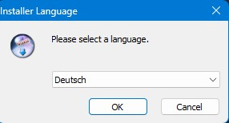
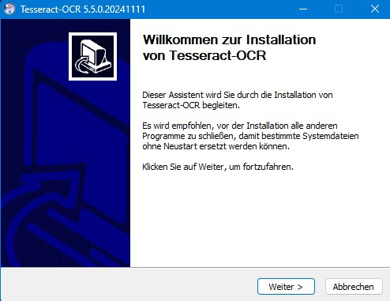
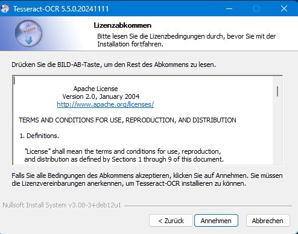
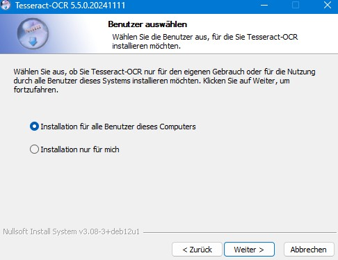
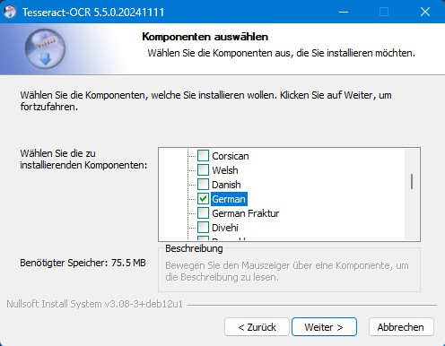
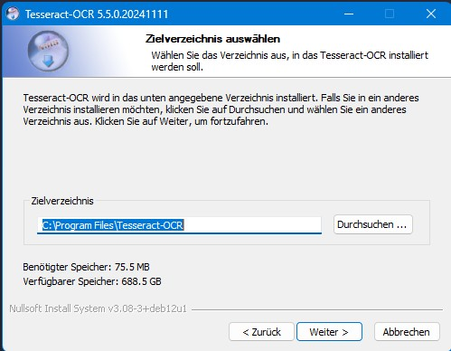
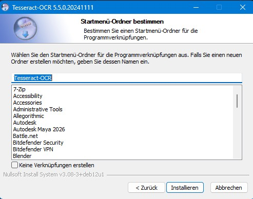
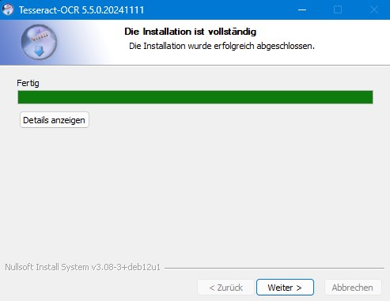
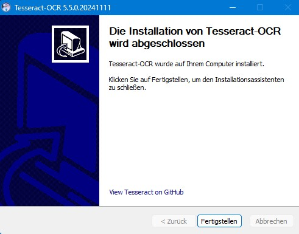
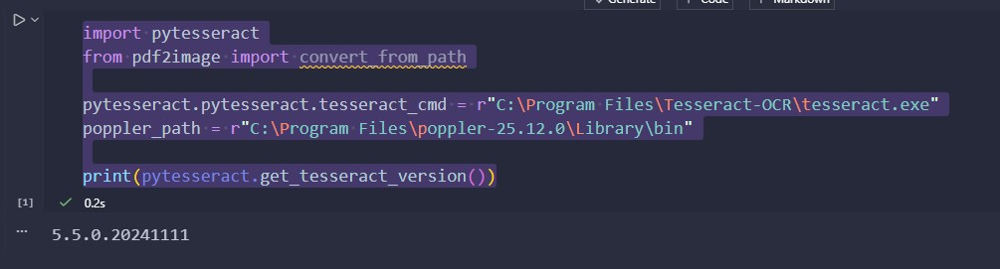

# OCR Setup Documentation

To enable OCR (optical character recognition) on a windows system, you need to install two components:
1. Tesseract
2. Poppler

This document describes, how those software components have been set up.

## Tesseract
Tesseract is the state of the art industry leading optical character recognition (OCR) software
On the [Tesseract Github](https://github.com/UB-Mannheim/tesseract/wiki) the following warning is published:

**WARNING: Tesseract should be either installed in the directory which is suggested during the installation or in a new directory. The uninstaller removes the whole installation directory. If you installed Tesseract in an existing directory, that directory will be removed with all its subdirectories and files.**

### Tesseract Download
The latest release (for Windows) can be obtained from [here](https://github.com/tesseract-ocr/tesseract/releases/download/5.5.0/tesseract-ocr-w64-setup-5.5.0.20241111.exe)

### Installation process
The process is pretty straight forward. After downloading and executing the installer you are prompted by the language selector window.



*Note: This is the language of the insaller, not the language used for OCR!*

After choosing your prefered language, click **Next** to continue and you will be presented the welcome screen.



Click **Next** to continue to the licence information (EULA).



After accepting the licence agreement your will be prompted for the multi-user or single (current) user installation.



Click **Next** to continue to the components selection.



**Here you will choose the additional languages you want to be recognized** As this system is based in Germany, the German data language is selected. Tesseract supports a variety of languages which you can see [here](https://tesseract-ocr.github.io/tessdoc/Data-Files-in-different-versions.html).

After selecting the necessary languages, click **Next** to continue to the path selection.



*Note: For this installation, the default directory is used.*

Hitting **Next** will lead you to the start menu creation screen.



Click on **Install** to start the installation process.
After copying the files you will see the following screen:



Click on **Next** to reach the final screen



Click on **Finish** to close the installer.

## Poppler
Poppler is the software component used by pdf2image

### Download
The software can be obtained from [here](https://github.com/oschwartz10612/poppler-windows/releases)

### Installation Process
Decompress the zip file and note the path to the `bin`folder:

```bash
C:\Program Files\poppler-25.12.0\Library\bin
```

## Final test
Create and execute the following cell in a jupyter notebook:
```jupyter
import pytesseract
from pdf2image import convert_from_path

pytesseract.pytesseract.tesseract_cmd = r"C:\Program Files\Tesseract-OCR\tesseract.exe"
poppler_path = r"C:\Program Files\poppler-25.12.0\Library\bin"

print(pytesseract.get_tesseract_version())
```
This should print you the installed version of Tesseract.


## Basic principle
The following code snippet describes the basic principle.

```python
import pytesseract
from pdf2image import convert_from_path

# Set paths
pytesseract.pytesseract.tesseract_cmd = r"C:\Program Files\Tesseract-OCR\tesseract.exe"

# PDF → Images → Text
images = convert_from_path(pdf_path, poppler_path=r"C:\Program Files\poppler-25.12.0\Library\bin")
for image in images:
    text = pytesseract.image_to_string(image, lang="deu+eng")
    print(text)
```